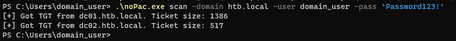
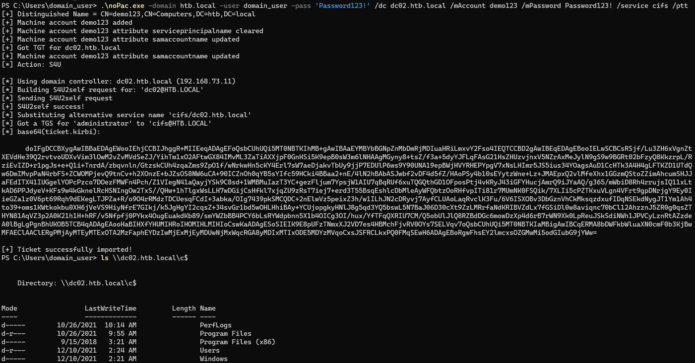

# noPac

CVE-2021-42287/CVE-2021-42278 Scanner & Exploiter. Yet another low effort domain user to domain admin exploit.

If a Domain Controller is vulnerable it will return a TGT without a PAC, all eyes on small size tickets.

## Mitigation

Patch your Domain Controllers!

## Credits

[Charlie Clark](https://twitter.com/exploitph) for his Rubeus fork and [Kevin Robertson](https://twitter.com/kevin_robertson) for SharpMad